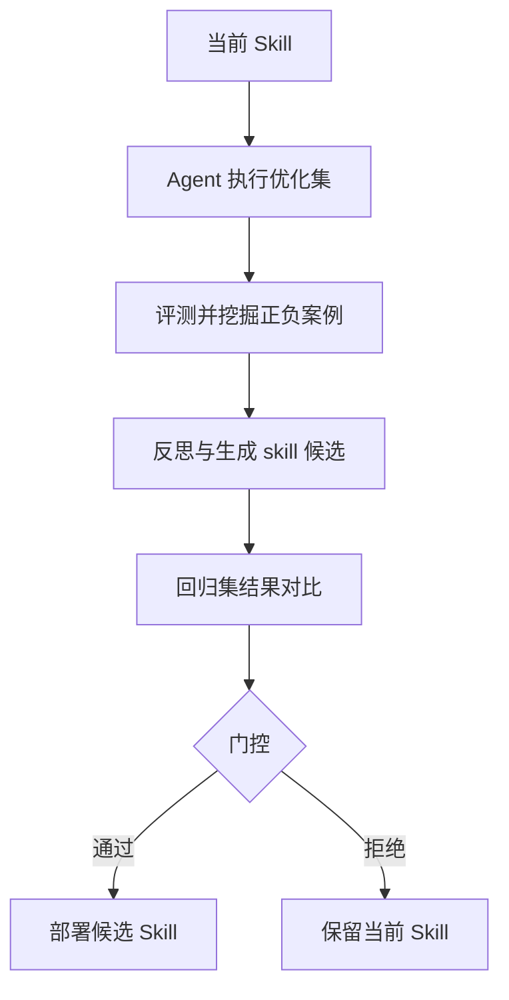

# Agent Harness Demo

这是一个 **Agent 自进化演示框架**。它模拟了一个 Agent 在工具调用（function calling）任务上的闭环进化流程：

1. 在优化集上诊断失败案例
2. 从诊断结果中生成候选规则（更新 `SKILL.md` 和 `fewshots`）
3. 在回归集上验证候选版本是否提升指标
4. 仅当候选版本通过回归门控时，才保留更新
5. 使用公开 [BFCLv3](https://gorilla.cs.berkeley.edu/blogs/8_berkeley_function_calling_leaderboard.html) sample + multiple 基准

整个流程会自动迭代运行，逐步提升 Agent 在 BFCL 数据集上的准确率。



---

## 功能特性

- **自进化闭环**：每次迭代生成候选 skill，通过回归测试门控决定是否接受
- **多种模型适配器**：支持基于规则的适配器（`rule`）和 OpenAI 兼容 API（`openai`）
- **多种反思策略**：支持规则反思（`rule`）、LLM 反思（`llm`）和自动选择（`auto`）
- **范围规则（Scoped Rules）**：从真实案例中挖掘带适用条件的规则，比全局规则更精准
- **可视化仪表盘**：基于 Streamlit 查看历史运行结果、指标变化和诊断分布
- **完整日志与报告**：每次运行的 trace、experience 和 summary 都会保存到 `runs/` 目录

---

## 项目结构

```
.
├── app.py                    # Streamlit 结果可视化
├── run_demo.py               # 命令行入口，运行
├── requirements.txt          # Python 依赖包
├── data/                     # BFCL 数据集
│   ├── mini_bfcl_subset.jsonl
│   ├── BFCL_v3_simple.jsonl
│   └── answer/               # 标准答案
├── skills/tool_calling/      # Skill 和 fewshots 存储
│   ├── SKILL_BASE.md         # Skill 初始模板
│   ├── SKILL.md              # 当前 skill（运行时会更新）
│   ├── fewshots_base.jsonl   # fewshots 初始模板
│   └── fewshots.jsonl        # 当前 fewshots（运行时会更新）
├── src/
│   ├── schema.py             
│   ├── dataset.py
│   ├── prompts.py
│   ├── model_adapter.py
│   ├── evaluator.py
│   ├── badcase.py
│   ├── reflector.py
│   ├── experience.py
│   ├── evolver.py
│   ├── skill_store.py
│   └── harness.py
└── runs/                     # 运行结果输出
    └── latest/
        ├── summary.json
        ├── iteration_00.json
        ├── traces/
        └── experience/
```

---

## 安装

### 1. 克隆仓库并进入目录

```bash
cd bfcl_agent_harness_demo
```

### 2. 创建虚拟环境（推荐）

```bash
python -m venv .venv

# Windows
.venv\Scripts\activate

# macOS / Linux
source .venv/bin/activate
```

### 3. 安装依赖

```bash
pip install -r requirements.txt
```

---

## 运行方式

### 命令行运行

#### 使用默认规则模型（无需 API Key）

```bash
python run_demo.py
```

默认使用 `rule` 模型适配器和 `rule` 反思策略，运行 3 次迭代。

#### 使用 OpenAI 兼容 API

```bash
set OPENAI_API_KEY=your_api_key
set OPENAI_BASE_URL=https://api.deepseek.com
set OPENAI_MODEL=deepseek-v4-flash

python run_demo.py 
  --data data/bfcl_v3_simple_multiple.jsonl 
  --model openai 
  --reflector llm 
  --iterations 5
  --reset-skill 
  --concurrency 50
```

> 在 macOS / Linux 上使用 `export` 代替 `set`。

### Web UI 可视化

运行完成后，可以用 Streamlit 查看历史结果：

```bash
streamlit run app.py
```

浏览器会自动打开仪表盘，展示每次迭代的：

- 接受的匹配率（Exact Match）变化
- 函数匹配、参数匹配、顺序匹配、JSON 合法性等细粒度指标
- 新增规则、失败案例、成功案例和范围规则数量

---

## 参数说明

运行 `python run_demo.py --help` 可查看完整参数：

| 参数 | 说明 | 默认值 |
|---|---|---|
| `--data` | BFCL 兼容的 JSONL 数据路径 | `data/mini_bfcl_subset.jsonl` |
| `--iterations` | 进化迭代次数 | `3` |
| `--model` | 模型适配器，可选 `rule` / `openai` | `rule` |
| `--run-dir` | 报告输出目录 | `runs/latest` |
| `--reset-skill` | 运行前重置 `SKILL.md` 和 `fewshots` | `False` |
| `--concurrency` | 并发模型调用数 | `10` |
| `--reflector` | 反思策略，可选 `auto` / `rule` / `llm` | `auto` |

`--reflector auto` 的行为：

- 当 `--model openai` 时使用 LLM 反思
- 当 `--model rule` 时使用规则反思

---

## 环境变量

使用 `--model openai` 或 `--reflector llm` 时需要配置：

| 变量 | 说明 | 默认值 |
|---|---|---|
| `OPENAI_API_KEY` | OpenAI 兼容 API 密钥 | 无 |
| `DEEPSEEK_API_KEY` | DeepSeek API 密钥（`OPENAI_API_KEY` 的替代） | 无 |
| `OPENAI_BASE_URL` | API 基础地址 | `https://api.deepseek.com` |
| `OPENAI_MODEL` | 模型名称 | `deepseek-v4-flash` |

---

## 数据格式

输入数据为 BFCL 兼容的 JSONL，每行一条样本，至少包含：

```json
{
  "id": "sample_001",
  "question": "用户查询文本",
  "tools": [...],
  "gold_calls": [...]
}
```

`gold_calls` 是标准答案中的工具调用列表，评估器会用它和模型预测结果对比。

更多格式说明可参考：[data/README_BFCL_FORMAT.md](data/README_BFCL_FORMAT.md)

---

## 输出说明

每次运行会在 `--run-dir` 目录下生成：

| 文件/目录 | 说明 |
|---|---|
| `summary.json` | 所有迭代的汇总报告 |
| `iteration_NN.json` | 第 NN 次迭代的详细报告 |
| `traces/` | 优化集和回归集的评估 trace |
| `experience/` | 本次迭代生成的经验（规则、fewshots 等） |

同时，`skills/tool_calling/SKILL.md` 和 `skills/tool_calling/fewshots.jsonl` 会在候选版本被接受时更新。

---

## 注意事项

- `rule` 模型适配器不调用任何外部 API，适合快速验证流程
- `--model openai` 会消耗 API token，请确保已配置密钥
- 运行过程中请勿手动修改 `SKILL.md`，除非你明确知道自己在做什么

